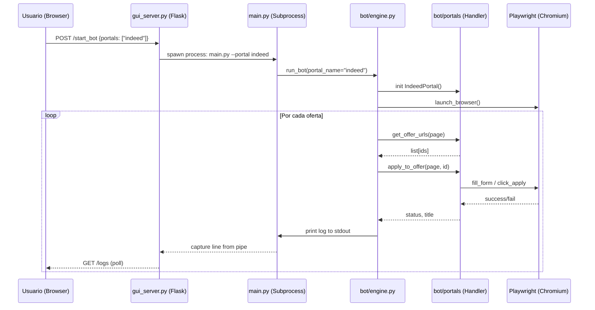
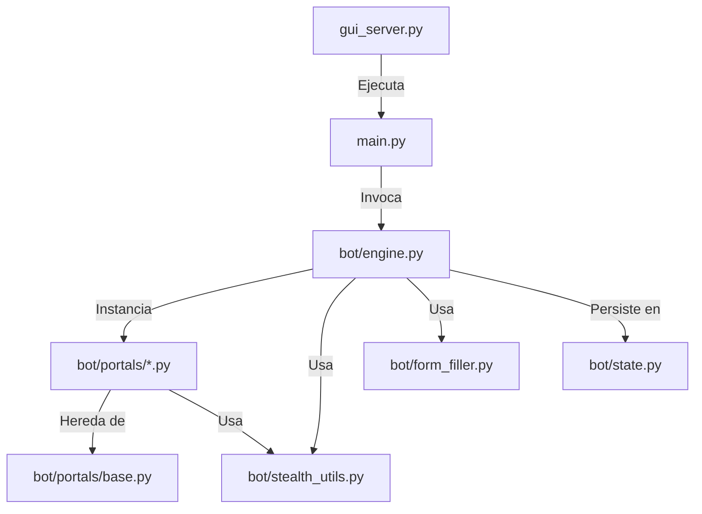

# 2.1 Patrón Arquitectónico

El sistema utiliza un patrón de **Estrategia (Strategy)** combinado con una arquitectura de **Capas (Layered Architecture)**.

- **Definición**: El patrón Estrategia permite definir una familia de algoritmos (handlers de portales), encapsular cada uno y hacerlos intercambiables. Esto permite que el motor central (`engine.py`) sea agnóstico a si está navegando en LinkedIn o en Indeed.
- **Evidencia**:
  - `bot/portals/base.py`: Clase base que define el contrato (`get_offer_urls`, `apply_to_offer`).
  - `bot/portals/linkedin.py`, `bot/portals/indeed.py`: Implementaciones concretas.
- **Desviaciones**: 
  - 🟡 Se detecta un acoplamiento ligero en `engine.py` con lógica específica para LinkedIn/Indeed en el manejo de sesiones, lo que rompe parcialmente la abstracción pura.

---

## 2.2 Mapa de Capas/Carpetas

| Capa / Carpeta | Responsabilidad | Regla de Dependencia |
| :--- | :--- | :--- |
| **Raíz (/)** | Orquestación y Punto de Entrada | Puede importar de todas las capas inferiores. |
| **bot/engine** | Motor de navegación y flujo de control | Importa de `portals` y `utils`. No debe importar del servidor Flask. |
| **bot/portals** | Adaptadores específicos para cada sitio web | Solo deben importar de `base.py` y utilidades comunes. |
| **bot/utils** | Funciones de soporte (stealth, filling, stats) | No deben tener dependencias circulares. |
| **templates** | Interfaz de usuario (Frontend) | Se comunica vía REST API con `gui_server.py`. |

---

## 2.3 Flujo de Datos End-to-End

---

## 2.4 Diagrama de Dependencias entre Capas

> [!NOTE]
> No se detectan dependencias circulares críticas entre los módulos core de Python.
