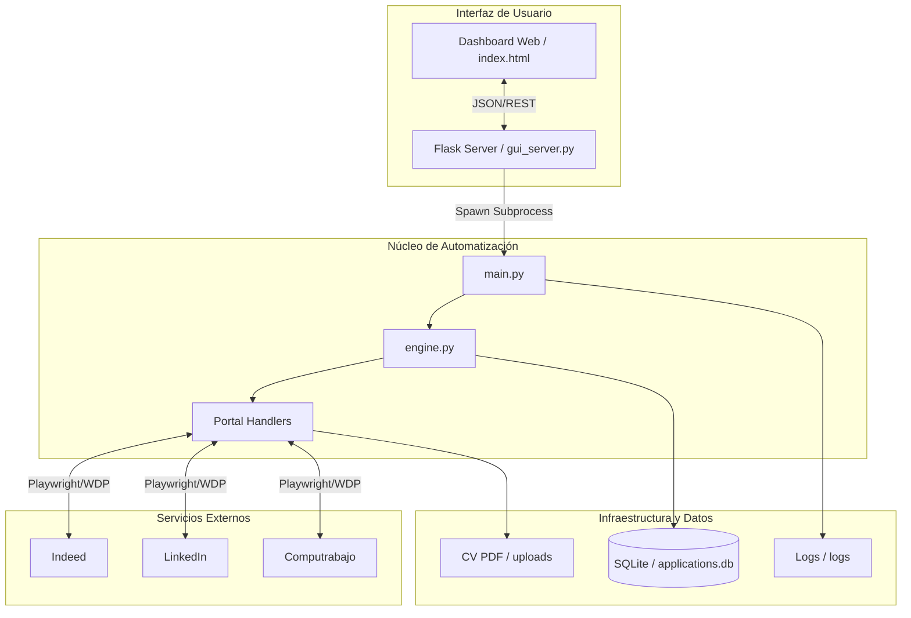

# 6.1 Mapa del Ecosistema

---

## 6.2 Ficha Técnica por Tecnología

### Playwright
- **Categoría**: Framework de Automatización.
- **Rol**: Gestiona las instancias del navegador, la navegación y la interacción con el DOM.
- **Interacción**: Se comunica directamente con los navegadores (Chromium) a través del protocolo CDP.

### Flask
- **Categoría**: Framework Web.
- **Rol**: Orquesta la comunicación entre el usuario y el bot. Gestiona la configuración persistente (`.env`).
- **Interacción**: Sirve el frontend y expone la API de logs.

### SQLite
- **Categoría**: Motor de Base de Datos.
- **Rol**: Registra cada URL postulada para garantizar que el bot no se repita.
- **Interacción**: Accedido vía `bot/state.py`.

---

## 6.3 Matriz de Relaciones

| Tecnología A | Relación | Tecnología B | Mecanismo |
| :--- | :--- | :--- | :--- |
| Flask | lanza | main.py | `subprocess.Popen` |
| main.py | captura | stdout | Pipes de sistema |
| Playwright | inyecta | Stealth Hooks | JavaScript Injection |
| engine.py | mapea | Profile Data | `pypdf` extraction |

---

## 6.4 Flujo de Arranque (Bootstrap)

1.  **Entry Point**: `gui_server.py` inicializa la app Flask.
2.  **Carga de Configuración**: Se lee el archivo `.env` para poblar el Dashboard.
3.  **Click en "Lanzar"**: Envía POST a `/start_bot`.
4.  **Hilo Secundario**: `threading.Thread` lanza `main.py`.
5.  **Validación de Entorno**: `bot/validator.py` verifica el CV y portales.
6.  **Inicialización de Browser**: Playwright levanta Chromium con el perfil de sesión guardado.
