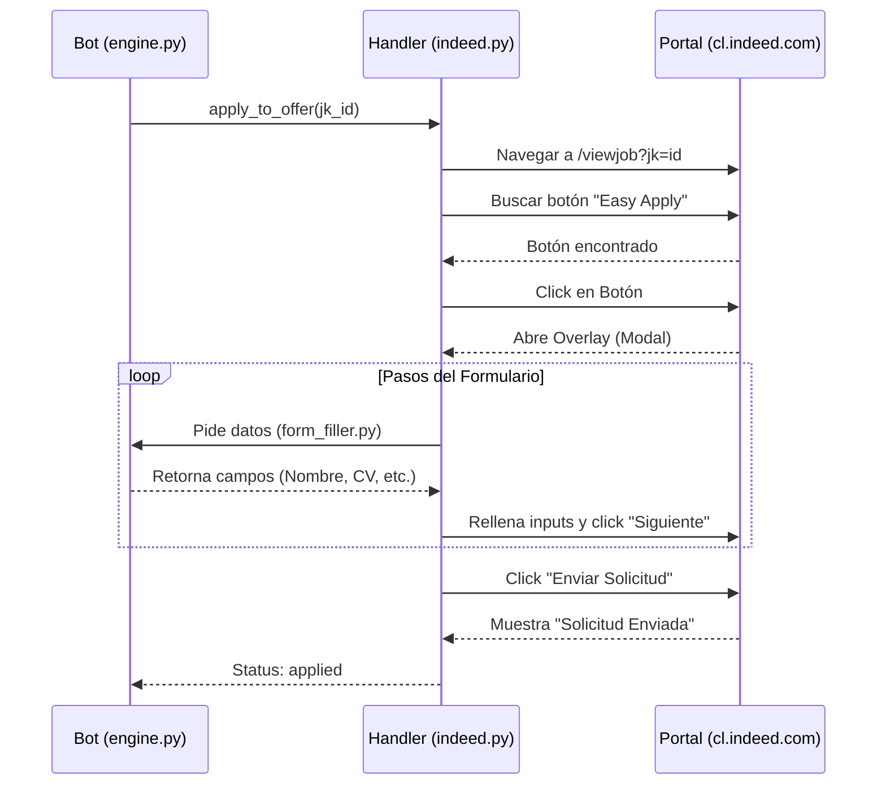

# 7.1 Inventario de Conexiones

| ID | Tipo | Origen | Destino | Protocolo | Dirección | Archivo |
| :--- | :--- | :--- | :--- | :--- | :--- | :--- |
| C01 | Interna | UI (Browser) | gui_server.py | HTTP/JSON | ↔ | `index.html` |
| C02 | Interna | gui_server.py | main.py | Subprocess Pipe | → | `gui_server.py:28` |
| C03 | Externa | bot/portals | Job Portals | HTTPS | ↔ | `bot/portals/*.py` |
| C04 | DB | bot/state | applications.db | SQL (SQLite) | ↔ | `bot/state.py` |

---

## 7.2 Flujo End-to-End: Postulación Exitosa

---

## 7.3 Integraciones con Terceros

### Portales de Empleo
El bot no utiliza APIs oficiales de los portales (LinkedIn/Indeed), ya que estas suelen ser restrictas para partners. En su lugar, utiliza **Web Automation** para interactuar con la interfaz de usuario pública.

### Estrategia de Resiliencia
- **Retries**: No implementados a nivel de red, se confía en los timeouts de Playwright (30s).
- **Timeouts**: Configurados granularmente por portal para esperar la carga de paneles laterales.
- **Detección de Bloqueos**: El sistema detecta desafíos de Cloudflare y detiene la ejecución para permitir resolución manual.
