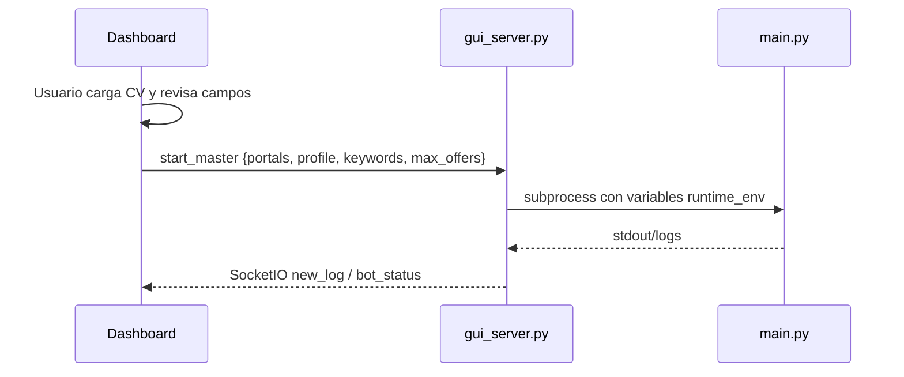

# Cambios del 2026-05-12

Este documento resume los cambios realizados hoy en el dashboard local, la API Flask/SocketIO y la politica de privacidad del flujo de CV.

## 1. API/Dashboard Ejecutado

Se valido que el dashboard corre en:

```text
http://127.0.0.1:5000/
```

La app se inicia desde `gui_server.py` y expone una UI en Flask. El servidor usa SocketIO para publicar estado y logs al navegador.

Evidencia:

- Ruta principal `/`: `gui_server.py:317`
- Configuracion operativa `/api/config`: `gui_server.py:321`
- Parseo de CV `/api/parse_cv`: `gui_server.py:336`
- Guardado operativo `/save_config`: `gui_server.py:367`
- Eventos SocketIO `start_master` y `stop_master`: `gui_server.py:397`, `gui_server.py:421`

## 2. Correccion de Guardado `.env` en Windows/OneDrive

Problema detectado: al guardar configuracion desde la UI aparecia `WinError 5 Acceso denegado`, provocado por el reemplazo temporal del archivo `.env` en Windows/OneDrive.

Solucion aplicada:

- Se reemplazo el uso de `python-dotenv set_key` por escritura controlada con `update_env_values`.
- La funcion conserva lineas no relacionadas, actualiza claves permitidas y puede remover claves sensibles.

Evidencia:

- `update_env_values`: `gui_server.py:198`
- Remocion de claves sensibles: `gui_server.py:206`, `gui_server.py:221`

## 3. Estado Profesional del Panel

Se mejoro el comportamiento del panel para poder detener e iniciar de nuevo sin refrescar.

Cambios principales:

- Estado del bot centralizado en `BotState`.
- Uso de `RLock` para evitar bloqueo al limpiar logs dentro del flujo de inicio.
- `run_id` interno para que un cierre tardio de una ejecucion anterior no apague visualmente una ejecucion nueva.
- Panel de estado operativo, accion requerida y sesiones.
- Deteccion y visualizacion de login/CAPTCHA mediante eventos SocketIO.

Evidencia:

- Estado y `run_id`: `gui_server.py:25`
- Estado de sesiones: `gui_server.py:241`
- Envio de estado al conectar: `gui_server.py:391`
- Panel runtime en frontend: `templates/index.html:437`, `templates/index.html:849`

## 4. Politica Nueva de Privacidad del CV

Decision tomada: el dashboard no debe guardar PDF/DOCX ni datos personales en disco.

Comportamiento nuevo:

1. El usuario selecciona un CV.
2. El frontend envia el archivo a `/api/parse_cv`.
3. El backend lo guarda solo como archivo temporal.
4. Se parsea el contenido.
5. El archivo temporal se borra.
6. Los campos detectados se autocompletan en pantalla.
7. Al guardar, no se persiste nombre, email, telefono, LinkedIn, carta ni ruta del CV.

Evidencia:

- Uso de `tempfile`: `gui_server.py:8`
- Archivo temporal para CV: `gui_server.py:349`
- Claves sensibles bloqueadas: `gui_server.py:174`
- Solo claves operativas persistidas: `gui_server.py:170`
- Remocion de datos sensibles al guardar: `gui_server.py:385`
- Autocompletado desde CV en frontend: `templates/index.html:478`, `templates/index.html:875`, `templates/index.html:884`

## 5. Datos Personales en Memoria Durante la Ejecucion

Para que el bot pueda usar datos autocompletados sin guardarlos en `.env`, el frontend envia los campos personales solo al iniciar el proceso.

Flujo:



Evidencia:

- Campos runtime definidos en frontend: `templates/index.html:437`
- Construccion de perfil en memoria: `templates/index.html:833`, `templates/index.html:835`
- Emision `start_master`: `templates/index.html:849`
- Inyeccion en entorno del proceso hijo: `gui_server.py:406`, `gui_server.py:416`

## 6. Portales Deseleccionados por Defecto

Cambio solicitado: no iniciar con portales seleccionados automaticamente.

Comportamiento nuevo:

- Todos los portales aparecen desmarcados al cargar el panel.
- El usuario debe seleccionar explicitamente los portales a ejecutar.

Evidencia:

- Item de portal inicia con `disabled-hint`: `templates/index.html:417`
- Checkbox sin atributo `checked` por defecto: `templates/index.html:420`

## 7. Keywords y Siguiente Mejora Pendiente

Se normalizo `.env` para que las keywords no queden con comillas escapadas antiguas. Estado actual:

```text
USER_KEYWORDS=it, dev, desarrollador, informatica, bodega
USER_MAX_OFFERS=5
```

Pendiente recomendado:

- Convertir `USER_KEYWORDS` en lista/chips.
- Ejecutar cada keyword por separado desde el dashboard.
- Conectar el dashboard con `--multi-keyword` o generar dinamicamente `KEYWORD_GROUPS`.

Evidencia:

- CLI ya tiene flag multi-keyword: `main.py:118`
- Motor multi-keyword: `bot/engine.py:739`
- Dashboard actualmente inicia por portal simple: `gui_server.py:265`

## 8. Verificaciones Realizadas

| Verificacion | Resultado |
|---|---|
| `python -m py_compile gui_server.py` | OK |
| `/api/config` responde | OK |
| `/save_config` ignora datos personales | OK |
| `uploads/` sin CVs persistidos | OK |
| `.env` sin claves personales | OK |
| Dashboard sirve HTML nuevo | OK |

## 9. Riesgos Pendientes

| Riesgo | Impacto | Recomendacion |
|---|---|---|
| Dashboard no usa aun `--multi-keyword` | Busquedas largas pueden degradar resultados en portales | Implementar ejecucion atomica por keyword |
| Dependencias Flask/SocketIO no estan en `requirements.txt` | Setup nuevo puede fallar aunque el entorno local funcione | Agregar `flask` y `flask-socketio` al manifest |
| Perfiles `sessions/` guardan cookies/sesion | Datos sensibles operativos quedan en disco por diseno | Documentar y agregar boton de limpieza por portal |
| Logs en tiempo real dependen de stdout del proceso hijo | Algunas lineas emitidas solo por logging pueden no aparecer en UI | Redirigir logging a stdout o tail de `logs/applyjob.log` |
